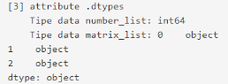

# Introduction to Pandas #

## Pendahuluan
“Apa kegunaan mempelajari Pandas? Aku tahunya Pandas nama hewan,” kelakarku pada Andra. Benar kan! Lagi-lagi aku menemukan istilah umum tapi punya makna berbeda di dunia data.

“Itu Panda, Aksara. Kalau Pandas berguna untuk melakukan analisis dan pengolahan data dari menengah sampai besar. Coba dibaca saja dulu modulnya biar lebih jelas. Nanti akan ada praktik yang memperjelas,” tukas Andra.

Seperti yang bisa kutebak, aku harus memahami modul dan pembelajaran baru ini sendiri. Karena kulihat Andra sudah melengang pergi setelah memberi intruksi sederhana seperti itu. Tak apa, perlahan aku terbiasa juga belajar mandiri. Walau memang lebih nyaman kalau dibimbing, hehehe.

## Memanggil Library Pandas
Pandas adalah library python open source yang biasanya digunakan untuk kebutuhan data analisis. Pandas membuat Python supaya dapat bekerja dengan data yang berbentuk tabular seperti spreadsheet dengan cara pemuatan data yang cepat, manipulasi data, menggabungkan data, serta ada berbagai fungsi yang lain.

Pertama-tama, harus di import dulu Pandas library di Python script yang telah tersedia.


biasanya ketika menggunakan library Pandas, library Numpy juga di-import, sehingga menjadi:


**Tugas praktek:**

Pada code editor dapat terlihat kode-kode yang tidak lengkap. Tugasnya sekarang mengimpor library pandas dan juga library numpy dengan mengisi _ _ _ pada masing-masing baris.

## DataFrame & Series

Di Pandas terdapat 2 kelas data baru yang digunakan sebagai struktur dari spreadsheet:

Series: satu kolom bagian dari tabel dataframe yang merupakan 1 dimensional numpy array sebagai basis datanya, terdiri dari 1 tipe data (integer, string, float, dll).
DataFrame: gabungan dari Series, berbentuk rectangular data yang merupakan tabel spreadsheet itu sendiri (karena dibentuk dari banyak Series, tiap Series biasanya punya 1 tipe data, yang artinya 1 dataframe bisa memiliki banyak tipe data).

Contoh:


**Tugas praktek:**

Pada code editor terlihat kode-kode yang tidak lengkap. Tugasnya sekarang adalah mengganti tanda _ _ _ di code editor dengan yang sesuai seperti yang diberikan pada contoh di atas. 

## Atribut DataFrame & Series - Part 1
```
Info: Theory dan Predefined code telah diperbarui pada tanggal 12 Mei 2022, pastikan kode yang telah ditulis disesuaikan kembali.
```

Dataframe dan Series memiliki sangat banyak atribut yang digunakan untuk transformasi data, tetapi ada beberapa attribute yang sering dipakai. Di sini series number_list dan dataframe matrix_list pada subbab sebelumnya digunakan kembali.


Tampilan output di console untuk masing-masing penggunaan attribute berikut merupakan hasil setelah menuliskan seluruh kode di code editor dan kemudian mengklik tombol .

**1. Method .info()**

Method .info() digunakan untuk mengecek kolom apa yang membentuk dataframe itu, data types, berapa yang non null, dll. Method ini tidak dapat digunakan pada series, hanya pada dataframe saja.


Output di console untuk penggunaan method .info() ini adalah:


**2. Attribute .shape**

Attribute .shape digunakan untuk mengetahui berapa baris dan kolom, hasilnya dalam format tuple (baris, kolom).


Output di console untuk penggunaan attribute .shape ini adalah:


**3. Attribute .dtypes**

Attribute .dtypes digunakan untuk mengetahui tipe data di tiap kolom. Tipe data object: kombinasi untuk berbagai tipe data (number & text, etc).


Output di console untuk penggunaan attribute .dtypes ini adalah:



**4. Method .astype(nama_tipe_data)**

Method .astype(nama_tipe_data) untuk convert tipe data berdasarkan tipe data seperti: float, int, str, numpy.float, numpy.int ataupun numpy.datetime.


Output di console untuk penggunaan method .astype() ini adalah:


**Tugas praktek:**

Pada code editor dapat terlihat kode-kode yang tidak lengkap. Tugas sekarang adalah mengganti tanda _ _ _ di code editor dengan yang sesuai seperti yang diberikan pada contoh di atas.

## Atribut DataFrame & Series - Part 2
Dataframe dan Series memiliki sangat banyak atribut yang digunakan untuk transformasi data, tetapi ada beberapa attribute yang sering dipakai. Di sini series number_list dan data frame matrix_list digunakan kembali.


Tampilan output di console untuk masing-masing penggunaan attribute berikut merupakan hasil setelah menuliskan seluruh kode di code editor dan kemudian mengklik tombol .

**5. Attribute .copy()**

Attribute .copy() digunakan melakukan duplikat, untuk disimpan di variable yang berbeda mungkin supaya tidak loading data lagi.


Output di console untuk penggunaan attribute .copy() ini adalah:


**6. Attribute .to_list()**

Attribute .to_list() digunakan untuk mengubah series menjadi list dan tidak dapat digunakan untuk dataframe.


Output di console untuk penggunaan attribute .to_list() ini adalah:


**7. Attribute .unique()**

Attribute .unique() digunakan menghasilkan nilai unik dari suatu kolom, hasilnya dalam bentuk numpy array. Attribute ini hanya digunakan pada series saja.


Output di console untuk penggunaan attribute .unique() ini adalah:


**Tugas praktek:**

Pada code editor dapat terlihat kode-kode yang tidak lengkap. Tugas sekarang adalah mengganti tanda _ _ _ di code editor dengan yang sesuai seperti yang diberikan pada contoh di atas.

## Atribut DataFrame & Series - Part 3
Dataframe dan Series memiliki sangat banyak atribut yang digunakan untuk transformasi data, tetapi ada beberapa attribute yang sering dipakai. Di sini series number_list dan data frame matrix_list pada subbab sebelumnya digunakan kembali.


Tampilan output di console untuk masing-masing penggunaan attribute berikut merupakan hasil setelah menuliskan seluruh kode di code editor dan kemudian mengklik tombol .

**8. Attribute .index**

Attribute .index digunakan untuk mencari index/key dari Series atau Dataframe.


Output di console untuk penggunaan attribute .index ini adalah:


**9. Attribute .columns**

Attribute .columns digunakan untuk mengetahui apa saja kolom yang tersedia di dataframe tersebut (hanya digunakan untuk dataframe saja). 


Output di console untuk penggunaan attribute .columns ini adalah:


**10. Attribute .loc**

Attribute .loc digunakan slice dataframe atau series berdasarkan nama kolom dan/atau nama index.


Output di console untuk penggunaan attribute .loc[] ini adalah:


**11. Attribute .iloc**

Attribute .iloc digunakan untuk slice dataframe atau series berdasarkan index kolom dan/atau index.


Output di console untuk penggunaan attribute .iloc[] ini adalah:


### **Tugas praktek:**

Pada code editor dapat dilihat kode-kode yang tidak lengkap. Tugas sekarang adalah mengganti tanda _ _ _ di code editor dengan yang sesuai seperti yang diberikan pada contoh di atas.

## Quiz
Diberikan dataframe
```
matrix = [[1,2,3],
          ['a','b','c'],
          [3,4,5],
          ['d',4,6]]
matrix_list = pd.DataFrame(matrix)
```

Apakah yang akan dihasilkan untuk command berikut?
```
matrix_list.iloc[0:2,2].to_list()
```

## Creating Series & Dataframe from List
Untuk membuat Series atau Dataframe bisa dari berbagai macam tipe data container/mapping di python, seperti list dan dictionary, maupun dari numpy array.

Pada sub bagian ini, kamu akan membuat Series dan Dataframe yang bersumber dari list. Sekadar meninjau bahwa list merupakan sebuah kumpulan data berbagai macam tipe data yang mutable (dapat diganti).

**Series**
Contoh membuat series dari list:


Output di console:


**DataFrame**

Contoh membuat dataframe dari list of list:


Output di console: 


### Tugas praktek:

Pada code editor dapat dilihat kode-kode yang tidak lengkap. Tugas sekarang adalah mengganti tanda _ _ _ di code editor dengan yang sesuai seperti yang diberikan pada contoh di atas.

## Creating Series & Dataframe from Dictionary

Untuk membuat Series atau Dataframe bisa dari berbagai macam tipe data container/mapping di python, seperti list dan dictionary, maupun dari numpy array.

Pada sub bagian ini, akan membuat Series dan Dataframe yang bersumber dari dictionary. Sekadar meninjau bahwa, dictionary merupakan kumpulan data yang strukturnya terdiri dari key dan value.

Series

Contoh membuat series dari dictionary:


Output di console:


DataFrame

Contoh membuat dataframe dari dict dengan setiap pasangan key dan value-nya berisi list yang sama panjangnya:


Output di console:


Tugas praktek:

Pada code editor dapat dilihat kode-kode yang tidak lengkap. Tugas sekarang adalah mengganti tanda _ _ _ di code editor dengan yang sesuai seperti yang diberikan pada contoh di atas.

## Creating Series & Dataframe from Numpy Array

Untuk membuat Series atau Dataframe bisa dari berbagai macam tipe data container/mapping di python, seperti list dan dictionary, maupun dari numpy array.

 

Pada sub bagian ini, akan membuat Series dan Dataframe yang bersumber dari numpy array. Sekadar meninjau bahwa, numpy array kumpulan data yang terdiri atas berbagai macam tipe data, mutable, tapi dibungkus dalam array oleh library Numpy.

Series

Contoh membuat series dari numpy array 1D:


Output:


DataFrame

Contoh membuat dataframe dari numpy array 2D:


Output:


### Tugas praktek:

Pada code editor dapat dilihat kode-kode yang tidak lengkap. Tugas sekarang adalah mengganti tanda _ _ _ di code editor dengan yang sesuai seperti yang diberikan pada contoh di atas.

## Quiz
Diberikan dataframe

```
arr_df = np.array([[1,2,3,5],
                   [5,6,7,8],
                   ['a','b','9',10]])
df = pd.DataFrame(arr_df)
```
Bagaimana cara mengubah data yang berupa string menjadi angka misal 'a' menjadi 11 dan 'b' menjadi 12?

# Dataset I/O

## Pendahuluan

Aku berhenti sejenak dari bacaan modul dan latihan kuis. Timbul satu pertanyaan yang menggelitikku. Dan, pas sekali aku melihat Andra sedang mampir ke meja di seberangku. Waktu yang tepat untuk memanggilnya dan bertanya.

“Ndra, memangnya file apa saja sih yang bisa dibaca oleh Pandas? Aku penasaran.”

“Saya kirim saja yah lengkapnya ada di link. Coba kamu cek di email,” jawab Andra singkat, padat, jelas.

Sesaat setelah aku bertanya, aku melihat Andra mengutak-atik ponselnya. Semenit kemudian, aku sudah menemukan link di kotak masuk email-ku yang berisi file-file yang bisa diakses Pandas. Aku pun membukanya dan menyimaknya satu per satu:

Pandas menyediakan berbagai method untuk membaca file tersebut hanya dengan dipanggil method itu, code yang lebih simple dan loading yang lebih, tentu saja output nya dapat berupa Series atau Dataframe.

Terdapat sangat banyak file yang dapat dibaca/dapat disimpan oleh Pandas, tapi ada beberapa file yang paling umum dan sering digunakan oleh praktisi data seperti berikut ini:

1. CSV (Comma Separated Values), antar data dalam satu baris dipisahkan oleh comma, ",".
2. TSV (Tab Separated Values), antar data dalam satu baris dipisahkan oleh "Tab".
3. Excel
4. Google BigQuery
5. SQL Query
6. JSON (Java Script Object Notation)

## Read Dataset - CSV dan TSV

CSV dan TSV pada hakikatnya adalah tipe data text dengan perbedaan terletak pada pemisah antar data dalam satu baris. Pada file CSV, antar data dalam satu baris dipisahkan oleh comma, ",". Namun, pada file TSV antar data dalam satu baris dipisahkan oleh "Tab".

Fungsi .read_csv() digunakan untuk membaca file yang value-nya dipisahkan oleh comma (default), terkadang pemisah value-nya bisa di set ‘\t’ untuk file tsv (tab separated values).

**Notes :**
Dataset csv : https://storage.googleapis.com/dqlab-dataset/sample_csv.csv

Dataset tsv : https://storage.googleapis.com/dqlab-dataset/sample_tsv.tsv

**Membaca file CSV**


Jika dijalankan akan menghasilkan output di console:


**Membaca file TSV**


Jika dijalankan akan menghasilkan output di console:


Tugas praktek:

Pada code editor dapat kamu lihat kode-kode yang tidak lengkap. Tugas kamu sekarang adalah mengganti tanda _ _ _ di code editor dengan yang sesuai seperti yang diberikan pada contoh di atas. 

Tampilkanlah tiga data teratas dari kedua jenis file yang telah dibaca!

## Read Dataset - Excel

File Excel dengan ekstensi *.xls atau *.xlsx cukup banyak digunakan dalam menyimpan data. Pandas juga memiliki fitur untuk membaca file excel.

Notes :

Dataset : https://storage.googleapis.com/dqlab-dataset/sample_excel.xlsx

Fungsi .read_excel() digunakan untuk membaca file excel menjadi dataframe pandas.


Jika dijalankan code di atas akan menghasilkan output di console seperti berikut:


Tugas praktek:

Pada code editor dapat kamu lihat kode-kode yang tidak lengkap. Tugas kamu sekarang adalah mengganti tanda _ _ _ di code editor dengan yang sesuai seperti yang diberikan pada contoh di atas. 

Tampilkanlah empat data teratas dari file excel yang telah dibaca!

## Read Dataset - JSON
Method .read_json() digunakan untuk membaca URL API yang formatnya JSON dan mengubahnya menjadi dataframe pandas. Method ini dapat digunakan seperti yang dicontohkan berikut ini:


Dataset JSON: https://storage.googleapis.com/dqlab-dataset/covid2019-api-herokuapp-v2.json

Jika dengan benar dituliskan code-nya di code editor maka setelah tombol  diklik kemudian akan mendapatkan hasilnya di console seperti berikut:


Tugas praktek:

Pada code editor dapat dilihat kode-kode yang tidak lengkap. Tugas sekarang adalah mengganti tanda _ _ _ di code editor dengan yang sesuai seperti yang diberikan pada contoh di atas. 

Tampilkanlah sepuluh data teratas dari file JSON yang telah dibaca!

## Read Dataset - SQL
Fungsi .read_sql() atau .read_sql_query() digunakan untuk membaca query dari database dan translate menjadi pandas dataframe, contoh case ini database sqlite.

Contoh penggunaannya:


Jika menggunakan .read_sql_query


Output:


Jika menggunakan .read_sql


Output:


Terlihat keduanya menghasilkan output yang sama.

## Read Dataset - Google BigQuery

Untuk data yang besar (big data), umumnya digunakan Google BigQuery. Layanan ini dapat digunakan jika telah memiliki Google BigQuery account.

Fungsi .read_gbq() digunakan untuk membaca Google BigQuery table menjadi dataframe pandas.


project_id="XXXXXXXX" adalah ID dari Google BigQuery account.

Output-nya:


## Write Dataset

Dalam bekerja sebagai data scientist/analis setelah dilakukan data cleaning dataset yang sudah rapi tentunya disimpan terlebih dahulu ke dalam media penyimpanan.  

Pandas menyediakan fitur demikian secara ringkas melalui penerapan method pada dataframe/series yang ditabelkan berikut ini:

Method      |    Code
----------  | ------------
.to_csv() → digunakan untuk export dataframe kembali ke csv atau tsv   | CSV ```df.to_csv("csv1.csv", index=False)```   TSV ```df.to_csv("tsv1.tsv", index=False, sep='\t')```
.to_clipboard() → export dataframe menjadi bahan copy jadi nanti bisa tinggal klik paste di excel atau google sheets    | ```df.to_clipboard()```
.to_excel() → export dataframe menjadi file excel   | ```df_excel.to_excel("xlsx1.xlsx", index=False)```
.to_gbq() → export dataframe menjadi table di Google BigQuery   | ```df.to_gbq("temp.test", project_id="XXXXXX", if_exists="fail")``` **temp**: nama dataset, **test**: nama table, if_exists: ketika tabel dengan dataset.table_name yang sama sudah ada, apa action yang ingin dilakukan (**"fail"**: tidak melakukan apa-apa, **"replace"**: membuang tabel yang sudah ada dan mengganti yang baru, **"append"**: menambah baris di tabel tersebut dengan data yang baru)

## Head & Tail

Seperti yang telah dipelajari sebelumnya bahwa ada method .head yang diterapkan pada suatu variabel bertipe pandas dataframe/series.

Method .head ditujukan untuk membatasi tampilan jumlah baris teratas dari dataset. Sementara itu, method .tail ditujukan untuk membatasi jumlah baris terbawah dari dataset.

Secara umum kedua method ini memiliki bentuk

```[nama_dataframe].head(n)``` 

dan 

```[nama_dataframe].tail(n)```

dengan n merupakan jumlah baris yang akan ditampilkan, jika tidak disebutkan n = 5 (sebagai nilai default dari n). 

Tugas Praktek:

Notes :

Dataset : https://storage.googleapis.com/dqlab-dataset/sample_csv.csv

Berdasarkan file sample_csv.csv cetaklah 3 data teratas dan 3 data terbawah. 

Jika berhasil maka tampilan berikut yang akan kamu peroleh di console.


## Quiz
Lakukan analisis dengan menggunakan BigQuery karena ada beberapa data BigQuery public datasets yang informasinya akurat dan sudah banyak data point-nya sehingga sudah bisa digunakan.

Tapi masalahnya, ada beberapa data adhoc yang bergantung tim lain yang belum terlalu melek data dan datanya masih disimpan dalam bentuk CSV.

Bagaimana langkah efektif yang dapat diambil untuk melakukan analisis gabungan data dari BigQuery dan CSV?

Hint: coba explore BigQuery public datasets dulu, kamu akan dapati data size yang besar (>1juta baris), akan susah kalau harus di export dan dilakukan analisis di excel.

# Indexing, Slicing, dan Transforming

## Pendahuluan
Aku masih fokus mengutak-atik dokumen yang bisa dibaca oleh Pandas ketika Andra menyahut dari belakangku. “Sudah dipelajari modulnya, Aksara? Apakah sudah cukup paham dasarnya penggunaan basic data of Pandas? Terutama cara bikin dataframe dan data source yang diolah dari Pandas?”

Seperti biasa, Andra ingin memastikan proses belajarku berjalan lancar. Tapi, mumpung ia berada di sini dan aku punya pertanyaan, lebih baik kusampaikan.

“Iya, Ndra. Tapi aku masih agak bingung soal manipulasi data, seperti membuat index, slicing, dan transform tipe data di series maupun dataframe,” ungkapku jujur. Apakah Andra akan membantuku? Aku menunggu responsnya sampai kemudian Andra menarik bangku ke sebelahku.

“Oke, coba sini saya bantu jelaskan.”

Mataku berbinar. Aku tak akan melewatkan kesempatan ini. Aku pun menggeser bangku agar lebih dekat dengan Andra yang siap menampilkan beberapa contoh manipulasi data, terutama membuat index, seperti yang dijelaskan selanjutnya.

## Indexing - Part 1
## Indexing - Part 2
## Indexing - Part 3
## Indexing - Part 4
## Indexing - Part 5
## Quiz
## Slicing - Part 1
## Slicing - Part 2
## Quiz
## Transforming - Part 1
## Transforming - Part 2
## Transforming - Part 3
## Transforming - Part 4
## Penutup dari Andra

# Handling Missing Values
## Pendahuluan
## Inspeksi Missing Value
## Treatment untuk Missing Valua - Part 1
## Treatment untuk Missing Valua - Part 2
## Treatment untuk Missing Valua - Part 3
## Treatment untuk Missing Valua - Part 4
## Treatment untuk Missing Valua - Part 5
## Quiz

# Mini Project
## Pendahuluan
## Project dari Andra
## Evaluasi Andra untuk Project yang Telah Disubmit
## Hasil Belajarku :)