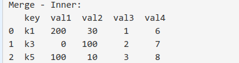

### Modul Content : Manipulation with Pandas Part 2
[1. Penggabungan Series/Dataframe](#1-penggabungan-seriesdataframe)
- [Pendahuluan](#pendahuluan)
- [Bagaimana Cara Menggabungkan Pandas Series/Dataframe?](#bagaimana-cara-menggabungkan-pandas-seriesdataframe)
- [Append](#append)
- [Concat](#concat)
- [Merge - Part 1](#merge---part-1)
- [Merge - Part 2](#merge---part-2)
- [Join](#join)
- [Quiz](#quiz)

[2. Pivot, Melt, Stack & Unstack](#pivot-melt-stack--unstack)
- [Pendahuluan](#pendahuluan-1)
- [Dataset](#dataset) 
- [Pivot](#pivot) 
- [Pivot_table](#pivot_table) 
- [Melt - Part 1](#melt---part-1) 
- [Melt - Part 2](#melt---part-2)
- [Stack & Unstack - Part 1](#stack--unstack---part-1)
- [Stack & Unstack - Part 2](#stack--unstack---part-2) 
- [Quiz](#quiz-1)

[3. Aggregation & GroupBy](#aggregation--groupby)
- [Pendahuluan](#pendahuluan-2)
- [Review Inspeksi Data](#review-inspeksi-data)
- [Groupby dan Aggregasi dengan Fungsi Statistik Dasar - Part 1](#groupby-dan-aggregasi-dengan-fungsi-statistik-dasar---part-1)
- [Groupby dan Aggregasi dengan Fungsi Statistik Dasar - Part 2](#groupby-dan-aggregasi-dengan-fungsi-statistik-dasar---part-2)
- [Groupby dan Aggregasi dengan Fungsi Statistik Dasar - Part 3](#groupby-dan-aggregasi-dengan-fungsi-statistik-dasar---part-3)
- [Groupby dengan Multiple Aggregations](#groupby-dengan-multiple-aggregations)
- [Groupby dengan Custom Aggregations](#groupby-dengan-custom-aggregations)
- [Groupby dengan Custom Aggregations by dict](#groupby-dengan-custom-aggregations-by-dict)
- [Quiz](#quiz-2)

[4. Time Series in Pandas](#time-series-in-pandas)
- [Pendahuluan](#pendahuluan-3)
- [Load Dataset as Time Series](#load-dataset-as-time-series)
- [Convert to Datetime](#convert-to-datetime)
- [Resampling untuk Time Series Data](#resampling-untuk-time-series-data)
- [Downsampling Data](#downsampling-data)
- [Upsampling Data](#upsampling-data)
- [Resampling by Frequency](#resampling-by-frequency)
- [Visualisasi](#visualisasi)
- [Quiz](#quiz-3)
- [Penutup](#penutup)


# 1. Penggabungan Series/Dataframe
## Pendahuluan

“Aksara, sedang apa?”

Aku pun mengalihkan perhatianku dari layar laptop ke Andra. Pagi-pagi sekali ia sudah menghampiriku. Diam-diam aku menebak materi baru apa lagi yang harus kupelajari ataukah ada proyek dadakan lagi yang perlu diselesaikan?

“Lagi latihan pakai Pandas, Ndra.”

“Oh, masih modul Pandas part 1 kemarin?”

Aku mengangguk.

“Pas banget, pagi ini saya mau ngirim ke kamu lanjutan modulnya. Lagipula modul kemarin kamu sudah lulus kok. Sekarang fokus ke Pandas part 2 saja. Kali ini materinya lebih dalam mengenai interaksi dengan tabular data menggunakan Pandas. Nanti kamu baca dan pelajari saja dulu.”

“Oh, oke.” 

Setelah obrolan tadi, aku langsung menerima pesan dengan lampiran materi lanjutan dari Andra. Penasaran dengan apa yang bisa Pandas lakukan lagi, aku pun segera membuka dan mencernanya:

Reference: https://pandas.pydata.org/pandas-docs/stable/user_guide/merging.html

## Bagaimana Cara Menggabungkan Pandas Series/Dataframe?

Sebagai seorang praktisi data, pasti sering kali bertemu dengan banyak file sekaligus dan data yang dibutuhkan tersebar di berbagai file tersebut dan membutuhkan metode untuk menggabungkan semua informasi yang dibutuhkan dari setiap file itu.

Dengan menggunakan excel atau tools pengolah spreadsheet lain hal itu bisa terjadi mungkin dengan menggunakan copy paste file satu ke file lainnya atau yang agak canggih menggunakan method importRange di google sheets. Tetapi tentu hal itu tidak bisa diandalkan ketika berurusan dengan big data yang datanya bisa miliaran rows dengan informasi yang tidak terbatas, Python dan Pandas adalah satu-satunya cara untuk mengatasinya.

Terdapat beberapa metode untuk menggabungkan Series/Dataframe di Pandas, yaitu:

* append
* concat
* merge
* join
Akan dibahas satu persatu dalam subbab berikutnya.

## Append

Method .append() dapat digunakan pada dataframe/series yang ditujukan untuk menambah row-nya saja. Jika di SQL memiliki 2 tabel atau lebih maka dapat menggabungkannya secara vertikal dengan Union. Jadi SQL Union ekuivalen dengan method .append() di Pandas. 

Perhatikan contoh berikut, mulai dengan method .append pada series.


Output-nya adalah:


Untuk dataframe:


Outputnya adalah


Tugas Praktek:

Untuk praktiknya terapkanlah method append dengan series s1 dan dataframe df1 ditempatkan setelah series s2 dan dataframe df2 masing-masingnya.

Jika dijalankan dengan menekan tombol  diperoleh output di console seperti berikut ini:


## Concat

Method .concat() dapat digunakan pada dataframe yang ditujukan untuk penggabungan baik dalam row-wise (dalam arah) atau column-wise.

Perhatikan contoh berikut, mulai dengan method .concat pada row-wise.


Output-nya:


Untuk penerapan concat pada column-wise:


Output-nya:


Dapat juga menambahkan identifier dari dataframe untuk data yang ditambahkan.


Output-nya:


Tugas Praktik:

Balikkanlah posisi kedua dataframe yang akan digabungkan dengan concat. 

Jika dijalankan dengan menekan tombol , output berikut yang akan diperoleh pada console


## Merge - Part 1

Method .merge() untuk menggabungkan Series/Dataframe yang bentuknya mirip dengan syntax join di SQL, specify left and right tables, join key, dan how to join (left, right, inner, full outer).

Mari kita perhatikan contoh berikut:


pd.merge yang ekivalen dengan SQL left join.


output:


pd.merge yang ekivalen dengan SQL right join.


output:


pd.merge yang ekivalen dengan SQL inner join.


output:



pd.merge yang ekivalen dengan SQL outer join.


output:


Tugas Praktik:

Pada contoh di atas keyword argument left=df1 dan right=df2, untuk praktik gunakanlah keyword argument untuk left dan right masing-masingnya adalah df2 dan df1.

Jika dijalankan dengan menekan tombol  dan tidak ada kesalahan, output berikut yang kamu peroleh di console.


## Merge - Part 2

Penggunaan method .merge yang telah dipelajari pada part 1 adalah untuk dataframe dengan index tunggal.

Bagaimana jika salah satu dataframe atau keseluruhan dataframe yang akan digabungkan tersebut memiliki multi index?


dengan df1 dan d2 di console:


Jika digabungkan secara langsung seperti yang telah dilakukan pada bagian sebelumnya.


akan menghasilkan:


terjadi kegagalan dalam merging kedua dataframe yang memiliki multi index.

Cara mengatasinya adalah dengan me-reset index pada kedua dataframe, kemudian merge akan mendeteksi common single/multi column di kedua dataframe dan melakukan merge.


dengan output-nya:


Tugas Praktik:

Kerjakanlah di code editor dengan cara mengisi kode yang tidak lengkap (_ _ _) sesuai dengan yang telah dicontohkan.


## Join
Method .join() digunakan pada dataframe untuk menggabungkan kedua data dengan set index pada kedua tabel tersebut sebagai join key, tanpa index, hal ini tidak akan berhasil.

Coba lihat kasusnya.


dengan output:


Terdapat error berupa:

```
ValueError: columns overlap but no suffix specified: Index(['key'], dtype='object')
```
 
Untuk itu, jika dilakukan seperti ini:


akan menghasilkan:


secara default, fungsi join ini akan mengeksekusi left join.

Untuk tipe join yang lain (contoh=inner), harus men-specify keyword how='inner' seperti yang dicontohkan berikut ini:


dengan output:


Tugas Praktek:


Lakukanlah seperti yang dicontohkan tetapi penggabungan dengan method join berupa outer join.

Jika berhasil dijalankan hasil berikut yang akan diperoleh:


## Quiz
Diberikan dataframe sebagai berikut:
```
df1 = pd.DataFrame({
   'key':['k1','k2','k3','k4','k5'],
   'val1':[200, 500, 0, 500, 100],
   'val2':[30, 50, 100, 20, 10],
  
})
df2 = pd.DataFrame({
   'key':['k1','k1','k5','k7','k10'],
   'val3':[1,2,3,4,5],
   'val4':[6,7,8,8,10]
})
```

Apa yang akan dihasilkan oleh code ini?
```
pd.merge(df1, df2, validate="1:1")
```

# 2. Pivot, Melt, Stack & Unstack
## Pendahuluan
Kotak masuk email-ku tak hentinya menerima sejumlah link baru dari Andra untuk bab-bab yang akan kupelajari di modul Pandas part 2 ini. Banyak sekali referensi dari Andra!

“Pivot, Melt, Stack, dan Unstack, apa ini?” gumamku sendiri membaca subject email Andra.

Aku pun bergegas mengaksesnya:

Reference: https://pandas.pydata.org/pandas-docs/stable/user_guide/reshaping.html

Melakukan format ulang pada dataset itu sangatlah penting, biasanya hal ini dilakukan untuk mengetahui keseluruhan data secara cepat dengan chart atau visualisasi. Untuk orang yang sudah mahir menggunakan spreadsheet pastilah tau banyak tentang fitur pivot ini.

Di Pandas, ada beberapa teknik untuk melakukan pivot atau unpivot yang biasa disebut as melt di Pandas, terdapat pula konsep stack yang artinya menumpuk data dengan kolom yang lebih sedikit (stack) sama seperti konsep melt dan ada pula yang memperluas data dengan kolom yang lebih banyak (unstack) sama seperti konsep pivot.

## Dataset
Untuk memahami konsep pivot, melt, stack, dan unstack pada Pandas mari persiapkan dataset sederhana terlebih dahulu.


dengan output:


Tugas Praktek:

Carilah unique records/value pada keempat kolom dataframe 'data'.

Jalankanlah dengan menekan tombol . Jika berjalan dengan lancar maka akan memperoleh output di console seperti yang ditunjukkan berikut ini:


## Pivot 

Untuk menerapkan menerapkan method .pivot() pada dataframe dapat dilakukan pada dataframe yang memiliki index tunggal ataupun index-nya adalah multi index.

Untuk dataset yang masih sama, yaitu data.


Pivoting dengan single column measurement.


dengan output:


Pivoting dengan multiple column measurement.


dengan output:


Penjelasan:

Apa yang berbeda dari kedua code di atas? Pada code pertama di specify values mana yang akan dilakukan pivot sedangkan di kedua tidak specific mana yang akan dilakukan pivot maka Pandas secara default men-treat kolom yang ada selain yang telah di specify as index dan columns as values instead.

Tugas Praktik:

Ketikkanlah kembali kode-kode yang diberikan di atas agar dapat lebih memahami konsep pivoting yang telah diberikan.

## Pivot_table 
Apa yang terjadi kalau output pivot tabel memiliki duplicate index? Seperti yang diketahui, index di dataframe adalah unique identifier untuk setiap row, jadi tidak boleh ada duplikat dan setiap membuat pivot tabel, harus specify index as kolom yang mana dan columns-nya memakai kolom yang mana.

Perhatikan contoh yang diilustrasikan berikut ini!


dengan output:


Hal ini dapat diatasi dengan melakukan method .pivot_table() pada dataframe. Metode ini sama seperti melakukan pivot pada tabel tapi juga melakukan groupby dan aggregation (aggfunc) pada level rows sehingga dipastikan tidak ada duplicate index di rows (secara default aggfunc = 'mean').

Perhatikan cuplikan berikut ini!


dengan output:


Keyword aggfunc yang digunakan pada method .pivot_table() dapat menggunakan nilai berikut:

* sum
* *'mean'*
* *'median'*

Tugas Praktek:

Seperti yang dicontohkan untuk meng-create pivot tabel dengan method .pivot_table() tetapi aggfunc yang digunakan adalah 'mean' dan 'median'.

Jalankanlah kode yang telah dibuat dengan menekan , jika tidak ada kesalahan maka output berikut akan diperoleh di console.


## Melt - Part 1

Teknik melt melalui pd.melt() digunakan untuk mengembalikan kondisi data yang sudah dilakukan pivot menjadi sebelum pivot.

Mari diperhatikan kembali dataframe yang telah digunakan sebelumnya dan dataframenya sudah di pivot.


dengan bentuk dataframe dari output baris ke-11.


Akan melakukan teknik melting pada dataframe output di atas.

[1] Melting dataframe


yang menghasilkan output:


[2] Dengan menspesifikasi keyword argument id_vars yang ditujukan untuk membuat fix kolom yang sebagai id tiap barisnya.


dengan output:


Tugas Praktik:

Kerjakanlah di code editor dengan cara mengisi kode yang tidak lengkap (_ _ _) sesuai dengan yang telah dicontohkan.

## Melt - Part 2
Mari melanjutkan ke bagian kedua dari penggunaan teknik melt ini. Mari lihat kembali dataframe yang telah diperoleh melalui pivoting


dengan bentuk dataframe dari output baris ke-11.


Lanjutkan dengan melakukan teknik melting pada dataframe output di atas untuk keyword argumen lainnya, yaitu

[3] Dengan menspesifikasikan keyword argument value_vars yang digunakan untuk menampilkan variasi value apa saja yang perlu dimunculkan di kolom variable. 

dengan output:


[4] Dengan spesifikasikan keyword argument var_name dan value_name yang digunakan untuk menampilkan nama kolom untuk variable dan value.


dengan output di console:


Tugas Praktik:

Kerjakanlah di code editor dengan jalan mengisi kode yang tidak lengkap (_ _ _) sesuai dengan yang telah dicontohkan.

## Stack & Unstack - Part 1
Konsep stacking dan unstacking sama dengan melt dan pivot secara berurutan, hanya saja tidak memasukkan index sebagai parameter di stack/unstack tapi harus set index terlebih dahulu, baru bisa melakukan stacking/unstacking dengan level yang bisa ditentukan sendiri.

Perhatikan kembali dataframe berikut dengan multi index-nya.


dengan output:


Mari terapkan bagaimana menggunakan teknik stacking dan unstacking ini pada dataframe multi index 'data':

[1] Unstacking dataframe


dengan output:


[2] Unstacking dengan specify level name


dengan output-nya di console:


[3] Unstacking dengan specify level position


dengan output yang diperoleh di console:


Tugas Praktik:

Kerjakanlah di code editor dengan jalan mengisi kode yang tidak lengkap (_ _ _) sesuai dengan yang telah dicontohkan.

## Stack & Unstack - Part 2

Dalam bagian kedua dari Stack & Unstack ini akan membahas stacking dataframe. Untuk itu, mari diperhatikan dataframe berikut ini:


dengan dataframe yang dicetak pada langkah ke-11.


[1] Stacking dataframe 


dengan output di console:


[2] Tukar posisi index setelah stacking dataframe


dengan output:


[3] Melakukan sort_index pada stacking dataframe


dengan output yang diperoleh di console:


Tugas Praktik:

Kerjakanlah di code editor dengan jalan mengisi kode yang tidak lengkap (_ _ _) sesuai dengan yang telah dicontohkan.

 
## Quiz
Diberikan dataframe:


Bagaimana cara untuk menghasilkan output seperti di bawah ini?


# 3. Aggregation & GroupBy
## Pendahuluan
Teknik agregasi diperlukan ketika mau melihat dataset dengan view yang berbeda, bisa set data tersebut akan dikelompokkan seperti apa, yang kemudian juga bisa menerapkan beberapa fungsi atau metode statistik ke hasil group dataset itu untuk mengetahui behavior dari data tersebut secara summary/overview.

**Basic Concept of Groupby & Aggregation**


Groupby memiliki konsep untuk:

Split: melakukan indexing/multi-indexing dengan apa yang di specify as groupby menjadi kelompok
Apply: menerapkan fungsi pada masing-masing kelompok tersebut
Combine: mengumpulkan semua hasil fungsi dari tiap kelompok kembali menjadi dataframe

## Review Inspeksi Data


Mari review kembali terkait dengan inspeksi data yang pernah dilakukan pada modul sebelumnya. Akan menggunakan dataset https://storage.googleapis.com/dqlab-dataset/LO4/global_air_quality_4000rows.csv

[1] Load data dari csv


dengan output:


[2] Melakukan pengecekan terhadap data


dengan output:


[3] Melakukan count tanpa groupby


dengan output:


[4] Melakukan count dengan groupby


dengan output:


Terdapat perbedaan antara melakukan count dengan groupby dan tanpa groupby:

Terdapat index apa yang di specify as groupby
Perhitungan jadi berdasarkan apa yang di specify as groupby
Overall, lebih mudah untuk membaca data summary yang telah di groupby


## Groupby dan Aggregasi dengan Fungsi Statistik Dasar - Part 1

Pada subbab ini akan menerapkan groupby dan fungsi aggregasi mean dan std untuk menentukan nilai rata-rata dan standar deviasi dari masing-masing kelompok data dari dataset https://storage.googleapis.com/dqlab-dataset/LO4/global_air_quality_4000rows.csv dan di assign sebagai variabel gaq.

Akan buat variabel pollutant.


dengan output dataframenya di console:


[1] Group berdasarkan country dan terapkan aggregasi mean, method .mean() setelah penerapan method .groupby() digunakan untuk mencari rata-rata dari tiap kelompok.


dengan output:


[2] Group berdasarkan country dan terapkan aggregasi std, method .std() setelah penerapan method .groupby() digunakan untuk mencari standard deviasi (penyimpangan) dari tiap kelompok.


dengan ouput di console:


## Groupby dan Aggregasi dengan Fungsi Statistik Dasar - Part 2

Akan melanjutkan untuk fungsi statistik lainnya yaitu .sum() dan .nunique() untuk mengaggregasi dataset pollutant setelah di groupby. 

[3] Group berdasarkan country dan terapkan aggregasi sum, method .sum() setelah penerapan method .groupby() digunakan untuk mencari total nilai dari tiap kelompok.


dengan output:


[4] Group berdasarkan country dan terapkan aggregasi nunique, method .nunique() setelah penerapan method .groupby() digunakan untuk mencari berapakah jumlah unique value dari tiap kelompok.


dengan output:


## Groupby dan Aggregasi dengan Fungsi Statistik Dasar - Part 3

Akan melanjutkan untuk fungsi statistik .min() dan .max() untuk mengaggregasi dataset pollutant setelah di groupby.

[5] Group berdasarkan country dan terapkan aggregasi min, method .min() setelah penerapan method .groupby() digunakan untuk memunculkan nilai terkecil dari tiap kelompok.


dengan output:


[6] Group berdasarkan country dan terapkan aggregasi max, method .max() setelah penerapan method .groupby() digunakan untuk memunculkan nilai terbesar dari tiap kelompok.


dengan output:


Tugas Praktik:

Gunakanlah method .first() dan .last() untuk aggregasi setelah penerapan .groupby() yang masing-masingnya bertujuan untuk memunculkan item pertama dan item terakhir dari tiap kelompok.

Jika kode yang tidak lengkap di code editor telah dengan benar diisi dan dijalankan dengan menekan tombol , diperoleh output berikut:


## Groupby dengan Multiple Aggregations
Kali ini akan menggunakan grouby dengan multiple aggregations yang berupa kombinasi antara beberapa fungsi. Mari perhatikan contoh berikut ini!


Jika dijalankan dengan menekan   dan output yang diberikan oleh baris ke-9 adalah:


Tugas Praktik: 

Terapkanlah multiple aggregations pada dataframe pollutant dengan fungsi aggregasinya adalah 'min', 'median', 'mean', 'max'.

Jika dengan benar kodenya ditulis dan kemudian dijalankan dengan menekan , diperoleh output seperti berikut:


## Groupby dengan Custom Aggregations
Groupby dengan Custom Aggregations
Dengan membuat sebuah Python function (user defined) dapat menggunakan sebagai custom aggregation pada dataframe yang telah di groupby.

Perhatikan contoh yang diberikan berikut ini!


di sini dibuat sebuah fungsi untuk menentukan range pada setiap kelompok. Jika dijalankan dengan menekan diperoleh output berikut di console:


Tugas Praktek:

Tentukanlah inter quartile range (IQR) pada setiap kelompok data, dan kemudian tampilkanlah 5 data teratas saja.

Jika kodenya berhasil dijalankan maka diperoleh output berikut:


## Groupby dengan Custom Aggregations by dict
Penggunaan custom aggregation lainnya pada dataframe yang telah di groupby dapat dilakukan dengan mempasskan sebuah dict yang berisi 'key' dict sebagai nama kolomnya dan 'value' dict adalah fungsi untuk aggregasi, baik user defined function atau yang telah tersedia.

Berdasarkan kode berikut ini:


Telah dimiliki dataset yang akan di apply teknik custom aggregation dengan menggunakan dict ini yaitu:


Akan apply teknik custom aggregation pada kolom 'o3' dan 'so' dengan fungsi aggregasi masing-masingnya adalah 'max' dan 'data_range'. Fungsi 'data_range' ini merupakan fungsi yang didefinisikan sendiri (user-defined) untuk menentukan jangkauan (range) data.


dengan output berupa:


Tugas Praktik:

Dengan dataset yang masih sama seperti tersedia di code editor, tentukanlah median untuk kolom 'pm10' serta iqr untuk kolom 'pm25' dan 'so2'. Tampilkan pula 5 data teratas saja.

Jika kode yang ditulis dengan benar kemudian dijalankan dengan menekan , maka akan diperoleh hasil seperti berikut ini:


## Quiz

Diberikan file 'global_air_quality.csv' jika kode berikut dieksekusi:


menghasilkan output:


Pollutant manakah yang mempunyai rata-rata nilai emisi tertinggi di dunia?

Asumsi: negara yang termasuk di file tersebut sudah semua negara di dunia.

# 4. Time Series in Pandas
## Pendahuluan

Baru saja aku kelar dengan latihan dan kuis-kuis dari Bab 3, link referensi dari Andra untuk materi selanjutnya seputar “Time Series in Pandas” sudah muncul lagi! 

Tampaknya ini ‘ujian’ baru dari Andra yang ingin menilai kegigihan belajarku. Kutarik nafas panjang. Tidak apa-apa, ini demi jadi data analyst profesional. Aku pantang menyerah!

Aku mengklik link dari Andra dan kembali menelusuri isi materinya:

Ketika berurusan dengan big data, biasanya akan selalu terdapat entitas waktu kapan suatu event itu terjadi, waktu ini digunakan untuk mengenali event itu terjadi pada suatu frame tertentu dan dapat dijadikan index yang membuat setiap event menjadi unique.

Basic format datetime menurut ISO 8601 yaitu YYYY-mm-dd HH:MM:SS.

## Load Dataset as Time Series

Terkadang Pandas salah mengenali object datetime menjadi object string dan pandas menjadi tidak bisa memanfaatkan full benefit dari time index.

Basic format datetime menurut ISO 8601: YYYY-mm-dd HH:MM:SS.

Terdapat beberapa cara untuk mengubah kolom waktu menjadi format yang benar as datetime object di Pandas. 

[1] read_csv, terdapat keyword argument 'parse_dates', yang jika di set True dan set index untuk kolom waktu tersebut maka kolom datetime tersebut akan transform as datetime Pandas dan menjadi index.


dengan output:


Tugas Praktik:

Kerjakanlah di code editor dengan jalan mengisi kode yang tidak lengkap (_ _ _) sesuai dengan yang telah dicontohkan.

 

## Convert to Datetime

Jika dataset yang telah terlebih dahulu atau telah terlanjur di load dengan pd.read_csv dan Pandas salah mengenali object datetime menjadi object string, maka dapat mengubah kolom tertentu dari dataset tersebut menjadi format datetime.

[2] pd.to_datetime digunakan untuk men-transform salah satu kolom di dataframe menjadi datetime Pandas dan kemudian set menjadi index. Mari perhatikan kembali contoh berikut:


dengan output:


Dataframe awal index-nya masih berupa urutan bilangan bulat dari nol. Kemudian dengan menerapkan pd.to_datetime dan set_index, dataframe sudah memiliki index berupa datetime.

Tugas Praktek:

Kerjakanlah di code editor dengan jalan mengisi kode yang tidak lengkap (_ _ _) sesuai dengan yang telah dicontohkan.

## Resampling untuk Time Series Data

Pandas time series juga memiliki fungsi resampling yang dapat berguna untuk:

**[1] Downsampling**

Mengurangi baris datetime menjadi frekuensi yang lebih lambat, bisa dibilang juga mengurangi rows dataset menjadi lebih sedikit

Contoh: mengubah kolom datetime yang awalnya daily menjadi monthly

**[2] Upsampling**

Kebalikan dari downsampling, menambah baris datetime menjadi frekuensi yang lebih cepat, menambah rows dataset dengan membuat kolom datetime menjadi lebih detail

Contoh: mengubah kolom datetime yang awalnya daily menjadi hourly

Dari resampling ini, kemudian dapat menerapkan metode statistik untuk transform value data yang ada (ex: mean, sum, count, etc).

Tabel resampling untuk time series:

Input       |  Description
--------    |  ----------------
'Min', 'T'  |  minute
'H'         |  hour
'D'         |  day
'B'         |  Business day
'W'         |  week
'M'         |  month
'Q'         |  quarter
'A'         |  year

## Downsampling Data

```
Info: Predefined code telah diperbarui pada tanggal 25 April 2022, pastikan kode yang telah ditulis disesuaikan kembali.
```

Sekarang akan dicoba melakukan proses downsampling pada dataset https://storage.googleapis.com/dqlab-dataset/LO4/global_air_quality_4000rows.csv yang telah di load sebelumnya.

Perhatikan dataset awal:


yaitu:


Dengan men-downsampling dari:

[1] Daily to monthly


dengan output:


[2] Daily to yearly


dengan output:


Tugas Praktek:

Kerjakanlah proses downsampling

Daily to weekly dan apply max
Daily to quaterly dan apply min
di code editor dengan jalan mengisi kode yang tidak lengkap (_ _ _).

Jika dengan benar ditulis dan dijalankan dengan menekan , maka diperoleh output berikut di console:


## Upsampling Data

Di bagian sebelumnya kita telah melakukan proses downsampling. Proses upsampling akan kita bahas dalam bagian untuk dataset yang masih sama.


dengan output:


Tugas Praktik:

Kerjakanlah proses upsampling daily to hourly dan apply mean di code editor dengan jalan mengisi kode yang tidak lengkap (_ _ _).

Jika dengan benar ditulis dan dijalankan dengan menekan , maka diperoleh output berikut di console:


## Resampling by Frequency

Pada bagian ini akan mempelajari bagaimanakah caranya me-resampling data (baik upsampling atau downsampling) berdasarkan frekuensi, misalnya sekali 2 minggu, tiap 12 jam, dsb.

Kondisi awal data yang dimiliki:


dengan output:


Untuk memahaminya silakan perhatikan contoh berikut ini:

[1] Data ini downsampling dari daily to 2 weekly, kemudian dihitung rata-ratanya, jika ada nilai NaN maka dapat diisi dengan fillna method = 'ffill'


dengan output:


[2] Selanjutnya, data awal di upsampling dari daily to 8 hourly, kemudian hitung rata-ratanya, jika ada nilai NaN maka dapat di isi dengan fillna method = 'bfill'


dengan output:


Tugas Praktik:

Kerjakanlah proses data awal resampling dari daily to bi-monthly, kemudian hitung rata-ratanya, jika ada nilai NaN maka dapat diisi dengan fillna method = 'bfill' serta mengisi kode yang tidak lengkap (_ _ _) di code editor.

Jika dengan benar ditulis dan dijalankan dengan menekan , maka diperoleh output berikut di console.


## Visualisasi

Selanjutnya untuk memvisualisasikan dengan menggunakan library matplotlib dataframe yang telah diolah (seperti yang telah dipelajari dari bab pertama hingga subbab sebelumnya di bab ini).

Terdapat beberapa plot styles yang dapat diterapkan dalam pembuatan visualisasi di matplotlib.

Color                | Marker                | Line
-------------------- |--------------------   |--------------------
b: blue              |  o: circle            |  : dotted
g: green             |  *: star              |  -: dashed
r: red               |  s: square            
c: cyan              |  +: plus

Visualisasi tentang average jumlah masing-masing polutan berdasarkan bulan waktunya.


 

[1] Membuat pivot table yang menunjukkan waktu di barisnya dan masing-masing value dari pollutant-nya dalam kolom.


dengan output:


[2] Membuat fungsi yang memberikan default value 0 ketika value-nya di bawah 0 dan apply ke setiap elemen dari dataset tersebut, kemudian menampilkannya sebagai chart.


dengan output:


Tugas Praktik:

Kerjakanlah di code editor dengan mengisi kode yang tidak lengkap (_ _ _) sesuai dengan yang telah dicontohkan.

 

 

## Quiz

Untuk dataset global_air_quality.csv yang telah di-load ke dalam data frame gaq.

Andra memintaku untuk menentukan trend dari rata-rata tahunan pollutant SO2 (kolom pollutant) yang dihitung berdasarkan value SO2 (kolom value).

Apa yang harus aku lakukan untuk membantu Andra ini?

## Penutup

Aku sedang asik mempraktikkan beberapa fungsi dan mengerjakan latihan soal di modul saat Andra memanggilku.

“Sudah cukup paham dengan modul Pandas part 2 ini, Aksara? Kalau saya perhatikan, kamu serius banget dari tadi. Sudah belajar apa saja?”


“Iya, aku tadi lagi nyoba nyelesein project end to end dari extracting data, load dataset, sampai manipulating data. Kalau sekarang lagi latihan menyimpan data ke dalam output yang sesuai. Lebih rumit dari yang kemarin, tapi masih ngerti, Ndra,” jelasku bersemangat.

Tak kusangka materi tentang Pandas ini seru sekali walau cukup padat. Seru karena aku tahu Pandas sangat implementatif dalam mengerjakan proyek-proyek data perusahaan. Banyaknya materi yang sempat kukeluhkan di awal jadi enggak terasa!
Aku mendapati Andra tersenyum tipis mendengar poin-poin yang sudah berhasil kupelajari.
Kalau dari responsnya, mungkinkah bakal ada proyek baru untukku?


“Apa yang kamu pelajari barusan akan sangat berguna dalam proyek analisis data nantinya dan jadi bekal kamu mempelajari machine learning nanti. Keep learning, Aksara. Saya sedang mempertimbangkan satu proyek untuk dipercayakan padamu lagi.”


“My pleasure!” sahutku langsung. Tak ada yang penerapan ilmu yang lebih baik daripada praktik kerja langsung bukan?