# Data Cleansing

## Apa itu Data Cleansing?
Fiuh! Materi tadi benar-benar penuh dengan latihan-latihan. Walaupun latihannya singkat, kalau jumlahnya banyak, ternyata menguras energi dan pikiranku juga. Apa mungkin Kroma sengaja memberikan referensi yang penuh latihan agar revisian aku nantinya bisa lebih lancar? Bisa juga caranya.

Aku mengecek sisa materi referensi yang diberikan, masih terdapat pembahasan seputar “Data Cleansing” lengkap dengan latihan-latihan singkat seperti sebelumnya. Baiklah, akan kujalani! Sisa ini saja kok, aku pasti bisa, batinku percaya diri.

Data Cleansing berarti proses mengidentifikasi bagian data yang salah, tidak lengkap, tidak akurat, tidak relevan atau hilang dan kemudian memodifikasi, mengganti atau menghapusnya sesuai dengan kebutuhan. Data Cleansing dianggap sebagai elemen dasar dari Data Science

Pada bagian ini, akan membahas data cleansing dari treatment terhadap missing data, treatment outliers, sampai deduplikasi data.

## Missing Data
Dataset yang ditemui di real-world biasanya akan memiliki banyak missing value. Kemampuan untuk treatment missing value sangat penting karena jika membiarkan missing value itu dapat memengaruhi analisis dan machine learning model. Sehingga jika menemukan nilai yang hilang dalam dataset, harus melakukan treatment sedemikian rupa. Cara check kolom yang mempunyai missing value:

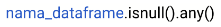

Cara treatment terhadap missing-value antara lain:

1. Leave as it is (dibiarkan)
2. Filling the missing value (imputasi)
3. Drop them (hapus row yang mengandung missing value)

**Imputasi** merupakan suatu metode treatment terhadap missing value dengan mengisinya menggunakan teknik tertentu. Bisa menggunakan mean, modus ataupun menggunakan predictive modelling. Pada modul ini akan membahas mengenai pemanfaatan function **fillna** dari Pandas untuk imputasi ini, yaitu

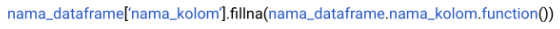

.function() yang dimaksud pada syntax di atas adalah penggunan fungsi .mean() atau .mode(). Penggunaan fungsi .mean() atau .mode() ini bergantung pada kondisi yang mengharuskan menggunakan nilai rata - rata atau modus dari kolom yang akan diimputasi, seperti
```
nama_dataframe['nama_kolom'].fillna(nama_dataframe.nama_kolom.mean())
```
atau
```
nama_dataframe['nama_kolom'].fillna(nama_dataframe.nama_kolom.mode())
 ```

Drop row yang mengandung missing value. Dapat menggunakan function dropna dari Pandas.

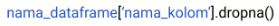

Untuk menangani missing data pada retail_raw, 

1. Ceklah jika terdapat missing value pada variabel dataframe, dan kemudian cetak ke console
2. Imputasi missing value pada kolom quantity dengan menggunaan nilai rataan (mean), dan kemudian cetak ke console
3. Drop-lah missing value pada kolom quantity, dan kemudian cetak ke console

Jika ditulis dengan benar dan dijalankan dengan menekan  diperoleh output berikut: 

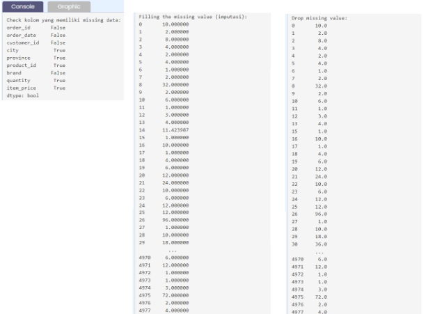


**Note**: Screen shoot untuk "Filling the missing value (imputasi):" dan "Drop missing value:" menunjukkan jumlah baris yang berbeda pada kolom quantity. Proses imputasi tentunya akan mempertahankan jumlah baris dari data karena missing value diisi dengan suatu nilai yang pada kasus kita ini menggunakan nilai rata-rata kolom bersangkutan. Sementara drop missing value tentu akan membuang baris yang memiliki missing value yang mengakibatkan jumlah baris data berkurang.

## Tugas Praktek
"Bagaimana, Aksara? Sudah dicoba dari modul yang saya kasih?” sapa Kroma. Kulihat ia baru keluar dari ruang meeting. Sedikit terkejut karena Kroma langsung menyapa dan menanyai prosesku, aku butuh beberapa detik sebelum menjawab.

“Sudah, sejauh ini paham sih. apalagi tiap subbab ada latihan singkatnya, banyak banget lagi! Cuma sedikit kendala saja soal missing value,” ujarku. Missing value memang bagian yang paling membuat penasaran karena sedari tadi aku berkutat dengan persoalan ini.

“Oke, bagus kalau memang lancar. Bisa temui saya di ruangan kalau dibutuhkan ya, Aksara.”

Aku mengangguk mantap. Aku tak mungkin bertanya pada Kroma dan memintanya mengajariku soal letak missing value-ku. Dan, tidak enak rasanya kalau merepotkan Senja lagi. Aku harus bisa mengandalkan diriku sendiri kali ini. Aku pun mengutak-atik dataku kembali selama hampir setengah jam dan menemukan jika missing value aku ada pada kolom item_price.

“Ah, akhirnya!” Dengan cepat aku melengkapi missing value tersebut dengan mean dari item_price. Berikut caranya:

Jika dengan benar telah dituliskan kodenya dan dijalankan dengan  diperoleh output seperti berikut:

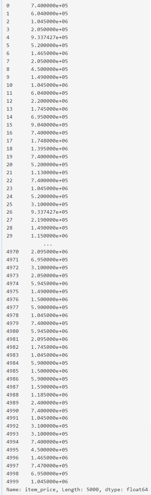

## Outliers
Outliers merupakan data observasi yang muncul dengan nilai-nilai ekstrim. Yang dimaksud dengan nilai-nilai ekstrim dalam observasi adalah nilai yang jauh atau beda sama sekali dengan sebagian besar nilai lain dalam kelompoknya.

Cara treatment terhadap outliers antara lain:

1. Remove the outliers (dibuang)
2. Filling the missing value (imputasi)
3. Capping
4. Prediction

Pada umumnya, outliers dapat ditentukan dengan metric IQR (interquartile range).

Rumus dasar dari IQR: Q3 - Q1, dan data suatu observasi dapat dikatakan outliers jika memenuhi kedua syarat dibawah ini:

* "< Q1 - 1.5 * IQR"
* "> Q3 + 1.5 * IQR"

Syntax di Python:

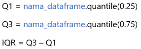


Kemudian untuk membuang outliers-nya:

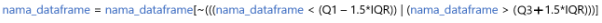

Mari melihat penggunaannya pada dataframe retail_raw untuk kolom quantity:

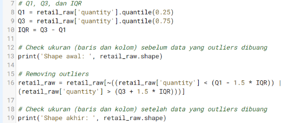

Ukuran dataframe retail_raw sebelum dan setelah dibuang outliers pada kolom quantity yaitu:

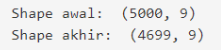

Note: Langsung di-submit saja ya tanpa di-run :)

## Tugas Praktek
Setelah berhasil mengatasi missing value tadi, aku memutuskan untuk mencoba menemukan sejumlah outliers menggunakan IQR. Dengan begitu, aku bisa mengetahui berapa IQR dari variabel item_price. 

Caranya dengan mengetikkan bagian yang kosong pada live code editor. 

## Deduplikasi Data
Duplikasi data merupakan data dengan kondisi pada row-row tertentu memiliki kesamaan data di seluruh kolomnya. Tentunya ada data yang duplikat dalam dataset yang dimiliki. Kondisi duplikasi harus diatasi dengan jalan mengeliminir baris yang mengalami duplikasi, sehingga proses ini dikenal dengan deduplikasi.

Untuk mengecek duplikasi data:

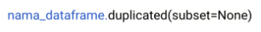

Syntax untuk membuang duplikasi:

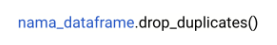

## Tugas Praktek
Terakhir lagi menuju selesai! Aku tinggal membuang duplikasi data dari dataset retail_raw.

Aku akan melengkapi kode pada live code editor berikut. 
