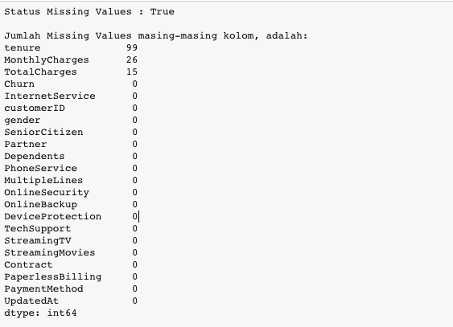
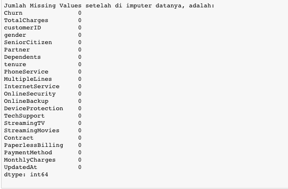
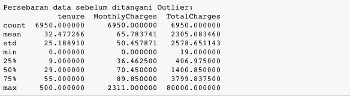
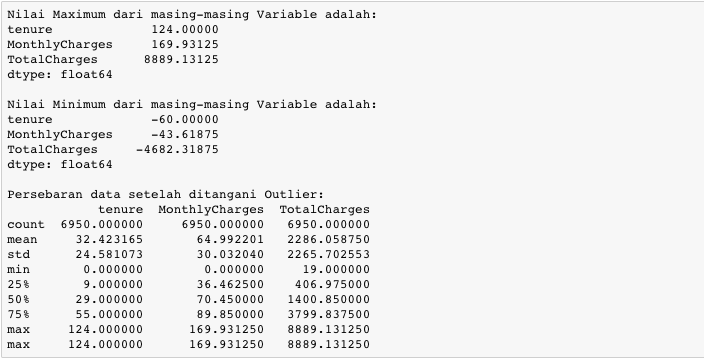
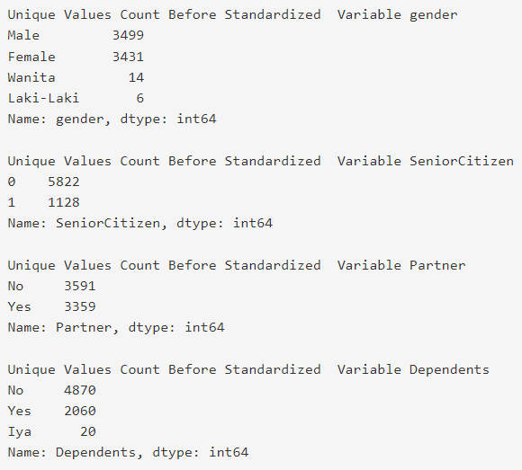
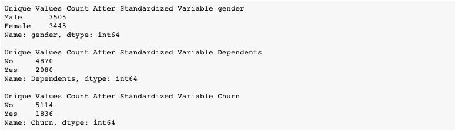

[1. Introduction](#introduction)
- [Latar Belakang](#latar-belakang)
- [Tugas dan Langkah](#tugas-dan-langkah)

[2. Library dan Data yang Digunakan](#2-library-dan-data-yang-digunakan)
- [Library yang Digunakan](#2-library-dan-data-yang-digunakan)
- [Data yang Digunakan](#data-yang-digunakan)
- [Import Library dan Dataset](#import-library-dan-dataset)

[3. Mencari Validitas ID Number Pelanggan](#3-mencari-validitas-id-number-pelanggan)
- [Memfilter ID Number Pelanggan Format Tertentu](#memfilter-id-number-pelanggan-format-tertentu)
- [Memfilter Duplikasi ID Number Pelanggan](#memfilter-duplikasi-id-number-pelanggan)
- [Kesimpulan](#kesimpulan)

[4. Mengatasi Missing Values](#4-mengatasi-missing-values)
- [Mengatasi Missing Values dengan Penghapusan Rows](#mengatasi-missing-values-dengan-penghapusan-rows)
- [Mengatasi Missing Values dengan Pengisian Nilai tertentu](#mengatasi-missing-values-dengan-pengisian-nilai-tertentu)
- [Kesimpulan](#kesimpulan-1)

[5. Mengatasi Outlier](#5-mengatasi-outlier)
- [Mendeteksi adanya Outlier (Boxplot)](#mendeteksi-adanya-outlier-boxplot)
- [Mengatasi Outlier](#mengatasi-outlier)
- [Kesimpulan](#kesimpulan-2)

[6. Menstandarisasi Nilai](#6-menstandarisasi-nilai)
- [Mendeteksi Nilai yang tidak Standar](#mendeteksi-nilai-yang-tidak-standar)
- [Menstandarisasi Variable Kategorik](#menstandarisasi-variable-kategorik)
- [Kesimpulan](#kesimpulan-3)

# 1. Introduction
## Latar Belakang
DQLab Telco merupakan perusahaan Telco yang sudah mempunyai banyak cabang tersebar dimana-mana. Sejak berdiri pada tahun 2019, DQLab Telco konsisten untuk memperhatikan customer experience-nya sehingga tidak akan ditinggalkan pelanggan.

Walaupun baru berumur 1 tahun lebih sedikit, DQLab Telco sudah mempunyai banyak pelanggan yang beralih langganan ke kompetitor. Pihak management ingin mengurangi jumlah pelanggan yang beralih (churn) dengan menggunakan machine learning.

Oleh karena itu, tim Data Scientist diminta untuk mempersiapkan data sekaligus membuat model prediksi yang tepat untuk menentukan pelanggan akan berhenti berlangganan (churn) atau tidak.

## Tugas dan Langkah
Sebagai seorang data scientist, kamu diminta untuk menyiapkan data sebelum dilakukan permodelan.

Pada tugas kali ini, kamu akan melakukan Data Preprocessing (Data Cleansing) bulan lalu, yakni Juni 2020.

Langkah yang akan dilakukan adalah,

1. Mencari ID pelanggan (Nomor telepon) yang valid
2. Mengatasi data-data yang masih kosong (Missing Values)
3. Mengatasi Nilai-Nilai Pencilan (Outlier) dari setiap Variable
4. Menstandardisasi Nilai dari Variable


# 2. Library dan Data yang Digunakan
## Library yang Digunakan
Pada analisis kali ini, akan digunakan beberapa package yang membantu kita dalam melakukan analisis data.

1. Pandas

Pandas (Python for Data Analysis) adalah library Python yang fokus untuk proses analisis data seperti manipulasi data, persiapan data, dan pembersihan data.

- read_csv() digunakan untuk membaca file csv
- str.match() digunakan untuk mencocokan dengan karakter tertentu
- drop() digunakan untuk menghapus
- count() digunakan untuk menghitung masing-masing variable
- drop_duplicates() digunakan untuk menghapus data duplicate rows
- fillna() digunakan untuk mengisi dengan nilai tertentu
- quantile() digunakan untuk melihat quantile ke tertentu
- mask() mengganti nilai tertentu jika kondisi memenuhi
- astype() mengubah tipe data
- value_counts() digunakan untuk menghitung unik dari kolom
- sort_values() digunakan untuk sort values
- isnull() digunakan untuk mendeteksi missing values
- dropna() digunakan untuk menghapus missing values
- replace() digunakan untuk mengganti nilai

2. Matplotlib

Matplotlib adalah library Python yang fokus pada visualisasi data seperti membuat plot grafik. Matplotlib dapat digunakan dalam skrip Python, Python dan IPython shell, server aplikasi web, dan beberapa toolkit graphical user interface (GUI) lainnya.

- figure() digunakan untuk membuat figure gambar baru
3. Seaborn

Seaborn membangun di atas Matplotlib dan memperkenalkan tipe plot tambahan. Ini juga membuat plot Matplotlib tradisional Anda terlihat sedikit lebih cantik.

- box_plot() digunakan untuk membuat box plot

## Data yang Digunakan
Untuk dataset yang digunakan sudah disediakan dalam format csv, silahkan baca melalui fungsi pandas di python df_load = pd.read_csv('https://storage.googleapis.com/dqlab-dataset/dqlab_telco.csv')

 
Untuk detail datanya adalah sebagai berikut:

- UpdatedAt Periode of Data taken
- customerID Customer ID
- gender Whether the customer is a male or a female (Male, Female)
- SeniorCitizen Whether the customer is a senior citizen or not (1, 0)
- Partner Whether the customer has a partner or not (Yes, No)
- Dependents Whether the customer has dependents or not (Yes, No)
- tenure Number of months the customer has stayed with the company
- PhoneService Whether the customer has a phone service or not (Yes, No)
- MultipleLines Whether the customer has multiple lines or not (Yes, No, No phone service)
- InternetService Customer’s internet service provider (DSL, Fiber optic, No)
- OnlineSecurity Whether the customer has online security or not (Yes, No, No internet service)
- OnlineBackup Whether the customer has online backup or not (Yes, No, No internet service)
- DeviceProtection Whether the customer has device protection or not (Yes, No, No internet service)
- TechSupport Whether the customer has tech support or not (Yes, No, No internet service)
- StreamingTV Whether the customer has streaming TV or not (Yes, No, No internet service)
- StreamingMovies Whether the customer has streaming movies or not (Yes, No, No internet service)
- Contract The contract term of the customer (Month-to-month, One year, Two year)
- PaperlessBilling Whether the customer has paperless billing or not (Yes, No)
- PaymentMethod The customer’s payment method (Electronic check, Mailed check, Bank transfer (automatic), Credit card (automatic))
- MonthlyCharges The amount charged to the customer monthly
- TotalCharges The total amount charged to the customer
- Churn Whether the customer churned or not (Yes or No)

## Import Library dan Dataset

Berdasarkan penjelasan mengenai library dan dataset yang akan digunakan, sekarang hal pertama yang akan kita lakukan adalah melakukan import library dan dataset ke dalam workspace kita.

Setelah dataset di-import ke dalam workspace, tampilkan jumlah kolom dan baris dari data set dengan menggunakan .shape dan print 5 baris teratas dengan menggunakan head() dan carilah ada berapa jumlah customerID yang bersifat unique dengan menggunakan .nunique

import pandas as pd
pd.options.display.max_columns = 50

```
df_load = pd.read_csv('https://storage.googleapis.com/dqlab-dataset/dqlab_telco.csv')
Notes:
```

1. pd.options.display.max_columns = 50 digunakan untuk mempermudah penampilan row data

2. Simpan dataset ke dalam variabel df_load


# 3. Mencari Validitas ID Number Pelanggan
## Memfilter ID Number Pelanggan Format Tertentu

Memfilter ID Number Pelanggan Format Tertentu
Mencari format ID Number (Phone Number) Pelanggan customerID yang benar, dengan kriteria:

Panjang karakter adalah 11-12.
Terdiri dari angka Saja, tidak diperbolehkan ada karakter selain angka
Diawali dengan angka 45 2 digit pertama.
 
Gunakan fungsi count() untuk menghitung banyaknya rows Customer ID, anda juga bisa menggunakan str.match() & regex untuk mencocokan dengan kriteria diatas. Jangan lupa gunakan astype() untuk merubah tipe datanya yang semula numeric

Notes : Buat kolom bantuan baru dengan nama `valid_id`

Hasil yang diharapkan adalah sebagai berikut:
```
Hasil jumlah ID Customer yang terfilter adalah 7006
```

## Memfilter Duplikasi ID Number Pelanggan

Memastikan bahwa tidak ada Id Number pelanggan yang duplikat. Biasanya duplikasi ID number ini tipenya:

Duplikasi dikarenakan inserting melebihi satu kali dengan nilai yang sama tiap kolomnya
Duplikasi dikarenakan inserting beda periode pengambilan data
Gunakan hasil dari pengolahan di tahap sebelumnya df_load untuk diolah di tahap ini. Gunakan fungsi drop_duplicates() untuk menghapus duplikasi rows, dan gunakan sort_values() untuk mengecek pengambilan data terakhir.
Berikut adalah hasil jumlah Customer ID:

```
Hasil jumlah ID Customer yang sudah dihilangkan duplikasinya (distinct) adalah 6993
```

## Kesimpulan
Validitas dari ID Number pelanggan sangat diperlukan untuk memastikan bahwa data yang kita ambil sudah benar. Berdasarkan hasil tersebut, terdapat perbedaan jumlah nomor ID dari data pertama kali di load sampai dengan hasil akhir. Jumlah row data ketika pertama kali di load ada sebanyak 7113 rows dan 22 columns dengan 7017 jumlah ID yang unique. Kemudian setelah di cek validitas dari ID pelanggan, maka tersisa 6993 rows data

# 4. Mengatasi Missing Values
## Mengatasi Missing Values dengan Penghapusan Rows
Selanjutnya kita akan menghapus rows dari data-data yang tidak terdeteksi apakah dia churn atau tidak. Diasumsikan data modeller hanya mau menerima data yang benar ada flag churn-nya atau tidak.

Gunakan isnull() digunakan untuk mendeteksi missing values dan dropna() untuk menghapus data yang missing values.

Berikut adalah hasil yang diharapkan:
```
Total missing values data dari kolom Churn 43
Total Rows dan kolom Data setelah dihapus data Missing Values adalah (6950, 22)
```

## Mengatasi Missing Values dengan Pengisian Nilai tertentu

Selain dengan menghapus rows dari data, menangani missing values bisa menggunakan nilai tertentu. Diasumsikan data modeller meminta pengisian missing values dengan kriteria berikut:

* Tenure pihak data modeller meminta setiap rows yang memiliki missing values untuk lama berlangganan di isi dengan 11.
* Variable yang bersifat numeric selain Tenure di isi dengan median dari masing-masing variable tersebut.

Tentukan:

* Apakah masih ada data yang missing values
* Jumlah missing values dari masing-masing variable
* Tangani missing values-nya

Hasil yang diharapkan:





## Kesimpulan
Setelah kita analisis lebih lanjut, ternyata masih ada missing values dari data yang kita sudah validkan Id Number pelanggannya. Missing values terdapat pada kolom Churn, tenure, MonthlyCharges & TotalCharges. Setelah kita tangani dengan cara penghapusan rows dan pengisian rows dengan nilai tertentu, terbukti sudah tidak ada missing values lagi pada data, terbukti dari jumlah missing values masing-masing variable yang bernilai 0. Selanjutnya kita akan melakukan penanganan pencilan (outlier)


# 5. Mengatasi Outlier
## Mendeteksi adanya Outlier (Boxplot)

Mendeteksi pencilan dari suatu nilai (outlier) salah satunya bisa melihat plot dari data tersebut menggunakan boxplot. Boxplot merupakan ringkasan distribusi sampel yang disajikan secara grafis yang bisa menggambarkan bentuk distribusi data (skewness), ukuran tendensi sentral dan ukuran penyebaran (keragaman). Berikut adalah tampilan umum dari boxplot dalam merepresentasikan outliers.


 
Penggunaan fungsi describe() pada kolom tenure, MonthlyCharges, dan TotalCharges ditunjukkan sebagai berikut.



Melalui fungsi describe() ini kita hanya memperoleh statistik deskriptif ketiga kolom ini. Agar outlier pada ketiga kolom ini dapat dideteksi maka kamu diminta untuk memvisualisasikannya menggunakan boxplot-nya. Setiap satu boxplot ada di satu canvas figure. 


## Mengatasi Outlier

Setelah kita mengetahui variable mana saja yang terdapat pencilan (outlier), selanjutnya kita akan atasi outlier dengan menggunakan metode interquartile range (IQR). Untuk detail jelasnya, bisa dilihat di ilustrasi di bawah ini:

Gunakan hasil dari pengolahan di tahap sebelumnya df_load untuk di olah di tahap ini. Gunakan fungsi quantile() untuk melihat quantile tertentu, dan gunakan mask() untuk me-replace nilai. Tentukan:

* Nilai minimum dan maximum data di tolerir
* Ubah nilai yang di luar range minimum & maximum ke dalam nilai minimum dan maximum

Hasil yang diharapkan adalah sebagai berikut:



## Kesimpulan
Dari ketiga boxplot dengan variable 'tenure','MonthlyCharges' & 'TotalCharges' terlihat jelas bahwasannya ada outlier. Hal ini bisa di identifikasi dari adanya titik-titik yang berada jauh dari gambar boxplot-nya. Kemudian kalau kita liat persebaran datanya dari kolom max nya juga ada nilai yang sangat tinggi sekali.

Kemudian nilai outlier tersebut ditangani dengan cara merubah nilainya ke nilai maximum & minimum dari interquartile range (IQR). Setelah di tangani outlier-nya, dan dilihat perseberan datanya, terlihat sudah tidak ada lagi nilai yang outlier.


# 6. Menstandarisasi Nilai
## Mendeteksi Nilai yang tidak Standar

Mendeteksi apakah ada nilai-nilai dari variable kategorik yang tidak standard. Hal ini biasanya terjadi dikarenakan kesalahan input data. Perbedaan istilah menjadi salah satu faktor yang sering terjadi, untuk itu dibutuhkan standardisasi dari data yang sudah ter-input.

Gunakan fungsi value_counts() untuk melihat jumlah data unique per variable-nya.

Adapun potongan dari hasil yang diharapkan adalah sebagai berikut:



Notes: Pada gambar hanya ditampilkan sebagian output yang diharapkan.

## Menstandarisasi Variable Kategorik

Setelah kita mengeteahui variable mana saja yang ada nilai tidak standard, maka kita standardkan dengan pola terbanyak nya, dengan syarat tanpa mengubah maknanya. Contoh : Iya -> Yes Kemudian liat kembali unique values dari masing-masing variable yang sudah di ubah. Gunakan fungsi replace() untuk menstandardkan nilai.

Berikut hasil yang diharapkan:



## Kesimpulan

Ketika kita amati lebih jauh dari jumlah unique value dari masing-masing variable kategorik, terlihat jelas bahwa ada beberapa variable yang tidak standar. Variable itu adalah:

* Gender (Female, Male, Wanita, Laki-Laki), yang bisa di standardkan nilainya menjadi (Female, Male) karena mempunyai makna yang sama.
* Dependents (Yes, No, Iya), yang bisa di standardkan nilainya menjadi (Yes, No) karena mempunyai makna yang sama.
* Churn (Yes, No, Churn), yang bisa di standardkan nilainya menjadi (Yes, No) karena mempunyai makna yang sama.

Setelah kita standardkan nilainya, dan kita amati kembali bentuk datanya, sudah terstandar dengan baik untuk unique value-nya.
